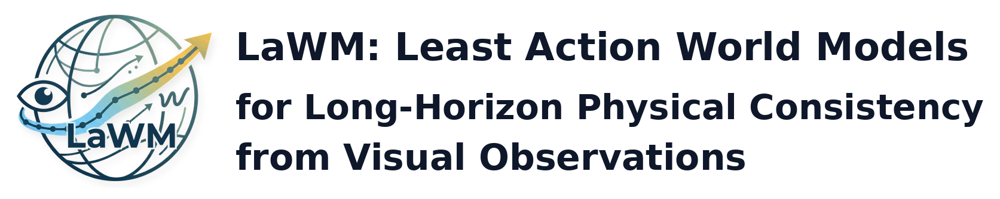
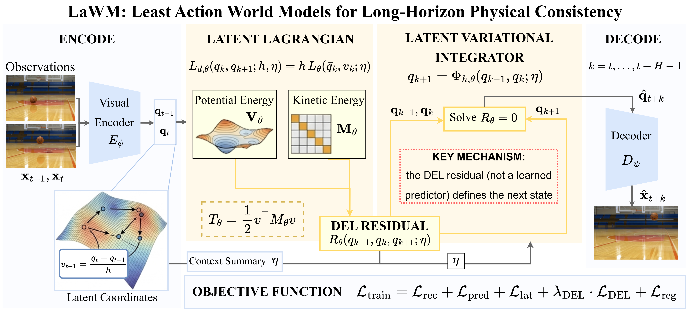

<p align="center">
  
</p>


This is the official method-core repository for **LaWM**, a least-action world model that learns physical dynamics through a latent discrete Lagrangian and rolls out future states by solving the discrete Euler-Lagrange condition.

<p align="center">
  <a href="https://chloeqxq.github.io/LaWM_ProjectPage/"></a>
  &nbsp;&nbsp;&nbsp;
  <a href="https://chloeqxq.github.io/LaWM_ProjectPage/LaWM.pdf"></a>
</p>

## 🔥 Update

- [2026-05-14] 🚀 Code released.
- [2026-05-14] 🌐 Project page released.
- [2026-05] 📄 Paper under review.

## 🎯 Overview

LaWM places physical structure inside the world-model transition. Instead of learning only an unconstrained next-state predictor, LaWM learns a latent discrete Lagrangian and advances trajectories by approximately satisfying the discrete Euler-Lagrange condition.

This repository is intentionally compact. It contains the core state-space method, training loop, rollout script, and physical consistency evaluator.

<p align="center">
  
</p>

## 🕹️ Usage

### Environment Setup

```bash
pip install -r requirements.txt
```

If needed, install the PyTorch wheel that matches your CUDA or CPU setup before running the commands below.

### Generate A Toy Dataset

```bash
python examples/toy_parabolic.py \
  --out data/toy_parabolic.pt \
  --samples 128 \
  --steps 64 \
  --dt 0.02
```

For full paper-scale experiments, use the data preparation code and assets from the relevant benchmark repositories or the paper artifact release. This repository provides the compact LaWM method implementation.

### Train LaWM

```bash
python scripts/train_state.py \
  --train-pt data/toy_parabolic.pt \
  --dt 0.02 \
  --epochs 10 \
  --batch-size 16 \
  --out-dir checkpoints/toy_parabolic
```

### Evaluate Physical Consistency

```bash
python scripts/eval_physics.py \
  --checkpoint checkpoints/toy_parabolic/lawm_final.pth \
  --trajectory-pt data/toy_parabolic.pt \
  --dt 0.02
```

The evaluator reports diagnostics such as stationary-action residual, learned-model energy drift, and state-space invariance scores.

### Roll Out A Checkpoint

```bash
python scripts/rollout.py \
  --checkpoint checkpoints/toy_parabolic/lawm_final.pth \
  --z0 "0,3,1,2,0,0,1,1,1" \
  --dt 0.02 \
  --steps 64 \
  --out-pt outputs/toy_rollout.pt
```

## 📌 Code Structure

```text
LaWM/
├── lawm/
│   ├── lagrangian.py   # learned latent discrete Lagrangian
│   ├── dynamics.py     # DEL residual and least-action rollout
│   ├── model.py        # state-space LeastActionWorldModel
│   ├── train.py        # training objective and loop
│   ├── metrics.py      # physical consistency metrics
│   └── utils.py
├── scripts/            # training, evaluation, and rollout entrypoints
├── examples/           # small runnable examples
└── requirements.txt
```

## 📑 Citation

If you find this project useful, please cite our paper:

```bibtex
@article{xiao2026lawm,
  title={LaWM: Least Action World Models for Long-Horizon Physical Consistency from Visual Observations},
  author={Xiao, Qixin and Ghaffari, Maani},
  journal={Under review},
  year={2026}
}
```

## 📝 Notes

Video generation demos, external baseline code, and benchmark-specific pipelines belong to their original repositories or separate artifact releases. When reproducing comparisons against another paper, please use that paper's official repository for its model and data pipeline, then compare against LaWM through the state trajectories or metrics scripts here.
